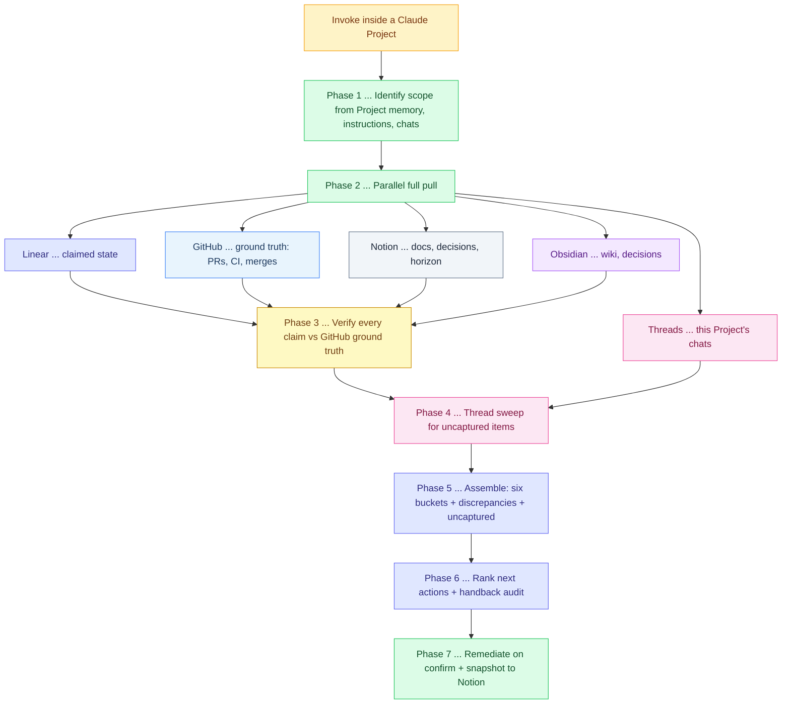

# Resume Active Work Runbook

## Context

Triggered when re-entering a project that is already underway. The job is to reconstruct exactly where things stand, catch anything left open or uncaptured, and hand back a ranked list of what to do next. This is the missing front door of the project lifecycle ... it sits alongside `starting-a-new-project` (bootstrap), `scoping-and-queuing-tasks` (define work), and `reviewing-completed-work` (close work).

Role: Development Planner throughout. This skill reads, verifies, orients, and proposes. It does not write or execute production code. Two carve-outs use the execution hierarchy's "if a tool can do it now, use the tool" rule: reverting a permanent-holder auto-close and reopening a provably-mis-stated issue are direct Linear MCP calls. Creating tickets for uncaptured items is also a direct call, but gated behind explicit confirmation (thread sweeps produce false positives). Anything needing code is handed to `writing-execution-prompts`; anything needing real scoping is handed to `scoping-and-queuing-tasks`.

Scope is ONE Claude Project. To review several, run the skill again in each Project.

## Scope & Identity Resolution

Identity lives in the **project identity registry** at `wiki/projects/_registry.md` in Obsidian. Resolve in this order:

1. **Read the registry** ... `read_note` on `wiki/projects/_registry.md`. This is the source of truth for each venture's Linear team, repos, wiki notes, Notion docs, and permanent holders.
2. **Pick the entry** ... if the current Claude Project's custom instructions contain a line `REGISTRY KEY: {key}`, use that entry directly. Otherwise form a hypothesis of which venture this Project is about from Project-scoped memory and recent chats (`conversation_search` / `recent_chats`, which return only this Project's conversations) and match it to an entry by `key` or `aliases`.
3. **Confirm only if ambiguous** ... if no entry matches with confidence, ask the user which `key` applies rather than guessing.

A single entry may span several Linear projects and repos. Resolve to the full set from the registry. State the resolved scope back in one line before proceeding (e.g., "Resuming: infrastructure ... SOC team, projects Infra + MCPX, repo infra-config, epic SOC-37").

## Phase Overview



## Workflow

### Phase 1 ... Identify scope
Resolve the Project's identity per the section above. Output a one-line scope statement and a time anchor (default: since the last session in this Project, derived from the most recent chat's timestamp via `recent_chats`).

### Phase 2 ... Parallel full pull
Pull each source in full for the resolved scope. Do not summarise yet ... gather first.

- **Linear** (claimed state): `list_issues` filtered by team/project and state; enumerate epic children with `parentId`; `get_issue` with `includeRelations: true` to capture linked PRs, labels, and blocking relations. Capture state, assignee, last update, linked PR refs. Additionally pull all open issues in scope with the `security` label or `[Security]` title prefix in Backlog/Triage ... these are nightly-security-review auto-triage tickets awaiting human disposition and feed Phase 4.5.
- **GitHub** (ground truth): `search_pull_requests` for open and recently merged PRs on each repo in scope; `pull_request_read` (`get_files`, `get_diff`) for PRs of interest; `get_check_runs` for CI status; `list_commits` / `list_branches` for stale branches. This is the authority every Linear claim is checked against.
- **Notion** (knowledge): fetch the Project's doc(s); capture decisions recorded and any "on the horizon" items.
- **Obsidian** (wiki): `read_note` on the Project's wiki note and linked decision notes (exact paths beat `search_notes` for known facts); capture architecture decisions and TODOs.
- **Threads** (this Project): `recent_chats` over the anchor window plus targeted `conversation_search` for the active epics/tickets. Feeds Phase 4.

### Phase 3 ... Ground-truth verification
Treat Linear state as a claim, not a fact. Verify each issue against GitHub:

| Linear says | Reality check | Flag if mismatch |
|---|---|---|
| Done | Linked PR merged AND CI green | False-done ... closed with no merge backing it |
| In Review | An open PR exists; report age in tick-cycles | Ghost review ... no PR, or stale beyond cycle |
| In Progress | Any merged PR for it? | Forgot-to-close ... merged but still open |
| In Progress | Any branch or PR at all? | Possibly stalled ... no work artifact |
| Todo / Backlog | Cross-check against thread sweep + merged PRs | Already done elsewhere, or duplicate |

Run the inverse too: a merged PR with no corresponding Linear issue is unticketed work. Check Notion/Obsidian for drift ... a recorded decision no ticket reflects, or a doc describing state that GitHub contradicts. This is the fixture-green/live-red guard applied at the status-review level: never report a ticket as done because Linear says so, only because a merge backs it.

Permanent-holder check (only when scope includes Infrastructure): confirm SOC-3, SOC-4, SOC-49, SOC-55, BES-12 are not closed. If any was auto-closed by Linear's GitHub integration on a linked merge, flag for immediate revert in Phase 7.

### Phase 4 ... Thread sweep for uncaptured items
From the Project's threads (Phase 2), extract implied commitments and decisions using cues like "we should", "next I'll", "need to", "TODO", "follow-up", "let's", "once X then Y", and any decision statements. For each candidate:
- Match against Linear by topic/keywords. If a ticket exists, verify its state per Phase 3.
- If no ticket exists, record it as an **uncaptured item** with a one-line description and the thread it came from.
Be conservative ... prefer surfacing a candidate for confirmation over silently creating it.

### Phase 4.5 ... Security ticket triage (joint judgement)
The nightly security review auto-creates `[Security]` issues into Backlog/Triage with no delegate, by design (v3.2 posture: human review before execution). Every resume session dispositions them ... they are never silently skipped, and the section's summary line is mandatory even at zero, so an empty section is distinguishable from a step that did not run.

For each open `[Security]` issue in scope, present: severity, one-line finding, repo, age in nights since creation, and persistence (check the most recent Security Review Log entry in Notion ... if the finding no longer appears, mark "possibly resolved"; if it appears, mark "persisting"; if the log is unavailable, mark "unknown"). Then take a joint verdict with the user per ticket:

- **PROCESS** ... promote for execution: `save_issue` state → Todo, delegate → Cyrus Agent. The issue body was written promotion-ready by the nightly review; do not re-scope unless the AC is visibly stale.
- **STRIKE** ... `save_issue` state → Canceled with a comment recording the reason. If struck as a false positive, additionally record it as a candidate allowlist entry (KG-1XX with proposed expiry) for the nightly-security-review prompt, and surface that doc change as a next action ... a strike without an allowlist candidate will recreate itself.
- **HOLD** ... remains in Backlog; record the hold count on the ticket (comment). Any ticket held across 3+ resume sessions is flagged RED in Phase 6 for a forced verdict.

Verdicts are judgment calls ... never auto-decide. Present the batch, take the user's call per ticket (or "process all" / "strike all" for a batch call), then execute the Linear mutations directly.

### Phase 5 ... Assemble outputs
Produce the report (template below): the six buckets, plus a discrepancies section (Phase 3 mismatches) and an uncaptured section (Phase 4 candidates).

The six buckets and their sources:
- **Current status** ... verified rollup (Done counts that are merge-backed, not claimed).
- **Most recently done** ... merged PRs since anchor, cross-referenced to Linear.
- **Outstanding** ... Todo/Backlog in scope + confirmed uncaptured items.
- **Forgot to close out** ... merged PR but Linear still open.
- **Couldn't close out** ... needs-human gate, NOT-CAPABLE verdicts, blocked relations.
- **Still underway** ... In Progress + In Review verified against open PRs, with tick-cycle age.

### Phase 6 ... Rank next actions + handback audit
Order the next-action list: (a) anything red (false-done, ghost review, permanent-holder closed, CI red, supervisor down if in scope), (b) anything one step from done (forgot-to-close), (c) critical-path unblocked work, (d) grooming and uncaptured-item creation. Then run the handback audit on this list itself: every item routed to the user is mapped to an allowed category (interactive-only auth / credential confirmed absent / irreversible high-stakes / judgment call) with exhaustion evidence, or it is converted to an autonomous step or execution prompt before delivery. An uncategorisable item is a defect.

### Phase 7 ... Remediate on confirm + snapshot
- **Direct now** (tool can do it): revert any permanent-holder auto-close via Linear MCP.
- **Confirm then act**: reopen provably-mis-stated issues; create confirmed uncaptured items (direct `save_issue`, or route through `scoping-and-queuing-tasks` if they need real scoping); produce execution prompts via `writing-execution-prompts` for anything needing code.
- **Snapshot**: push a dated state summary to the Project's Notion doc so there is a trail to diff over time.

## Output Template

```
RESUMING: {scope} ... anchor {since}

RED (do first)
- {item} ... {why} ... {action}

STILL UNDERWAY
- {KEY-N} {title} ... {state}, {n} cycles, PR #{x} {ci}

FORGOT TO CLOSE OUT
- {KEY-N} ... PR #{x} merged {date}, Linear still {state}

COULDN'T CLOSE OUT
- {KEY-N} ... {needs-human / blocked-by KEY-M / NOT-CAPABLE: reason}

OUTSTANDING
- {KEY-N} {title} ... {Todo/Backlog}

RECENTLY DONE (verified)
- {KEY-N} ... PR #{x} merged, CI green

DISCREPANCIES
- {KEY-N} ... Linear says {x}, GitHub shows {y}

SECURITY BACKLOG ... {N} open, joint triage required
- {KEY-N} [{CRITICAL|HIGH}] {finding one-liner} ... {repo}, {age} nights, {persisting|possibly resolved|unknown}, held {h}x
(verdicts: PROCESS → Todo+Cyrus | STRIKE → Canceled+allowlist candidate | HOLD → flag RED at 3 holds)
Summary line (mandatory even at zero): "Security backlog: {N} open, {p} processed, {s} struck, {h} held."

UNCAPTURED (from threads, confirm to create)
- {one-liner} ... from {thread}

NEXT ACTIONS (ranked)
1. ...

HANDBACK AUDIT · {N} handbacks · {M} decisions pending
1. {action}
   Category · {interactive-only auth | credential confirmed absent | irreversible high-stakes | judgment call}
   Blocked because · {why no autonomous path exists}
   Return to me · {artefact to paste back; omit if none}
(N = 0): nothing owed by you

DECISIONS PENDING (not handbacks)
- {item} ... {what you do once it is called}
```

## Identity Registry

Identity is NOT pasted into Claude Projects. It lives in one Obsidian note, `wiki/projects/_registry.md`, with a block per venture (key, aliases, Linear team + projects, repos, Obsidian notes, Notion docs, permanent holders). The skill reads it in Phase 1.

To make a Project's lookup deterministic, optionally add one line to that Claude Project's custom instructions:

```
REGISTRY KEY: {key}
```

To onboard a new venture, add a block to the registry (copy the shape of an existing entry); no skill change is needed.

## Related Skills
- `scoping-and-queuing-tasks` ... for any uncaptured item that needs real scoping before it becomes a ticket
- `writing-execution-prompts` ... for any next action that needs code
- `reviewing-completed-work` ... the supervisor verdict path for items found mid-review
- `starting-a-new-project` ... the sibling bootstrap runbook
