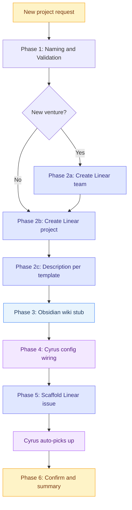

# New Project Kickoff Runbook

## Context

Triggered when the user wants to start a new project under an existing venture, or to bootstrap a brand-new venture. Covers naming, Linear setup, Obsidian wiki stub, Cyrus config wiring, and the first scaffold issue. The goal is zero missed steps ... every project gets the same infrastructure.

Role: Development Planner throughout. Some actions are direct via MCP tools (Linear, Obsidian, GitHub). Code and file changes (scaffold, Cyrus config edit) are delegated via Claude Code execution prompts per `writing-execution-prompts`.

## Inputs Required

Before starting, confirm with the user:

1. **Venture** ... which company hierarchy this belongs to (AnytimeInterview, Bespoke, GymToGreen, ScreenTimeMath, DickBot, SC Internal, or a new venture being bootstrapped)
2. **Project name** (display name in Linear, e.g., "Customer Portal")
3. **Repo name** (kebab-case, what `git@github.com:michaelkd01/{name}.git` will be ... e.g., "bespoke-customer-portal")
4. **Tech stack** (Python, TypeScript/Next.js, Vite/React, Swift, etc.)
5. **Brief purpose** (one sentence ... what does this project do?)

Use `ask_user_input` for bounded choices (venture, tech stack). Use open-ended questions for name and purpose.

## Phase Overview



## Workflow

### Phase 1 ... Naming & Validation

1. Confirm the repo name follows conventions:
   - Lowercase, kebab-case (npm / GitHub compatibility)
   - No spaces or underscores
   - Matches `git@github.com:michaelkd01/{name}.git`
2. Construct the full local repo path: `/Users/michaeldavidson/Developer/{repo-name}`
3. If this is a brand-new venture (no existing Linear team), flag Phase 2a is required.

### Phase 2 ... Linear Setup

**2a. (New venture only) Create Linear team**

No MCP path for this ... must be done in the Linear UI:
- Linear → Settings → Teams → New team
- Name: {Venture}
- Key: short prefix (e.g., "GTG" for GymToGreen)

Once the team exists, `cyrus self-auth-linear` must be run interactively on the Mac Mini before any Cyrus config changes for this workspace. This is a known blocker; see `wiki/projects/cyrus.md`.

**2b. Create the Linear project**

Use Linear MCP `save_project`:
- `teamId`: the venture's team ID
- `name`: the project name
- `description`: see Phase 2c

**2c. Write the project description**

Follow the standard five-section template at `wiki/decisions/linear-project-description-template.md`:

- **Purpose paragraph** ... one paragraph, names audience and job-to-be-done
- **Scope** ... what is in vs out, sibling-project boundaries
- **Surface** ... repo, routes/endpoints, auth gate, layout/middleware
- **Stack** ... framework, runtime, hosting, build chain, branch model
- **Sibling projects** ... cross-links to peers with one-line summaries
- **Wiki** ... five wiki path pointers max

Rules from the template (full list in the decision note):
- No local file paths ... GitHub URL is canonical
- Stack identical across siblings sharing a repo
- Sibling list is exhaustive
- Five wiki links max

Push via Linear MCP `save_project` with `id` (returned from 2b) and `description`.

### Phase 3 ... Obsidian Wiki Setup

Use Obsidian MCP `write_note` to create the project hub note.

For new ventures, also create the venture hub at `wiki/projects/{venture}.md` with sub-sections for each project.

For a new project under an existing venture, create `wiki/projects/{venture}/{project}.md` with this stub:

```
# {Project Name}

One-line purpose. Sits under [[{venture}]] in the venture hub.

## Architecture
TBD.

## Decisions
None yet.

## Repo
- github.com/michaelkd01/{repo-name}
- CLAUDE.md mirrored at `raw/repos/{repo-name}-CLAUDE.md` after first execution.

## Connections
- [[{venture}]]
- [[cyrus]]
```

### Phase 4 ... Cyrus Config Wiring

Cyrus needs a repo entry in `~/.cyrus/config.json` to pick up Linear issues for this project. Source-of-truth: `/Users/michaeldavidson/Developer/infra-config/cyrus/` (branch `feature/any-42-cyrus-config-tracking` until promoted to main).

This requires a file change on the Mac Mini ... delegate via a Claude Code execution prompt per `writing-execution-prompts`. The prompt must:

1. Add a new entry under `repositories` in `~/.cyrus/config.json` with:
   - `repositoryPath`: `/Users/michaeldavidson/Developer/{repo-name}`
   - `repositoryName`: `{repo-name}`
   - `baseBranch`: `main`
   - `linearWorkspaceId`, `linearWorkspaceName`, `linearToken`: copy from an existing entry for the same workspace, or freshly auth'd if new venture
   - `teamKeys`: the Linear team key (e.g., `["BES"]`)
   - `routingLabels`: `{repo-name}` as the label value if this workspace contains multiple repos (mirrors the `anytimeinterview2` pattern)
   - `appendInstruction` and `disallowedTools`: copy from `anytimeinterview2` entry as baseline
2. Mirror the change in the source-of-truth at `/Users/michaeldavidson/Developer/infra-config/cyrus/`.
3. `pm2 restart cyrus`.
4. Verify with `curl -s https://cyrus.socialclub.ltd/status`.

**Known blockers:**
- New Linear workspaces require interactive `cyrus self-auth-linear` first (cannot be automated)
- The infra-config source-of-truth lives on a feature branch until promoted

### Phase 5 ... Scaffold Issue

Create the first Linear issue under the new project ... a scaffold task that produces the initial repo skeleton.

Use Linear MCP `save_issue`:
- `teamId`: venture team ID
- `projectId`: from Phase 2b
- `title`: "Scaffold {repo-name} repo"
- `description`: see below
- `labelIds`: include the `routingLabels` value from Phase 4 if multi-repo workspace
- `priority`: 1 (Urgent) ... unblocks first real work

Scaffold issue description:

```
Create the initial scaffold for {repo-name} at /Users/michaeldavidson/Developer/{repo-name}.

## Acceptance Criteria
{paste stack-specific AC from the table below}

## Verification
- {build command} passes
- {test/lint command} passes
- git init, initial commit, push to github.com/michaelkd01/{repo-name}

## CLAUDE.md
Include a CLAUDE.md with: project purpose, commands (build, test, lint, dev), architecture overview, key dependencies.
```

Stack-specific Acceptance Criteria:

| Stack | AC |
|---|---|
| Python (uv) | `pyproject.toml` (uv-managed, Python 3.12+), `src/{pkg}/__init__.py`, `src/{pkg}/main.py`, `tests/test_main.py` with one passing test, `.gitignore` (Python), `CLAUDE.md`, `README.md`. `ruff check` passes, `pytest` passes. |
| TypeScript / Next.js | `npx create-next-app` with TypeScript + Tailwind, `.gitignore` (Node), `CLAUDE.md`, `README.md`. `npm run build` passes, `npx tsc --noEmit` passes. |
| Vite / React | `npm create vite@latest` with react template (TS or JSX as specified), ESLint configured, `.gitignore` (Node), `CLAUDE.md`, `README.md`. `npm run build` passes, `npm run lint` passes. |
| Swift / iOS | Xcode project with SwiftUI app target + test target with one passing test, `.gitignore` (Xcode/Swift), `CLAUDE.md`, `README.md`. `xcodebuild clean build` passes. |

Cyrus will auto-pick up the issue once it's in the right state and Phase 4 wiring is verified.

### Phase 6 ... Confirm & Summarize

Post a summary to the user:

```
Project {ProjectName} initialized:
- Linear: project created under {Venture} team, description per template
- Obsidian: wiki/projects/{venture}/{project}.md stub created
- Cyrus: repo entry added to ~/.cyrus/config.json (pm2 restarted, status: green)
- Scaffold: Linear issue {TEAM-KEY}-{N} created, Cyrus will pick up
- Repo path: /Users/michaeldavidson/Developer/{repo-name}
- Next: monitor Cyrus pickup, then first real issue
```

## Post-Scaffold Checklist (after Cyrus runs the scaffold)

- [ ] Verify repo exists on GitHub at `michaelkd01/{repo-name}`
- [ ] Verify CLAUDE.md is present and has correct commands
- [ ] Mirror CLAUDE.md to wiki: `raw/repos/{repo-name}-CLAUDE.md` (manual or via separate task)
- [ ] Update the Linear project description's Wiki section to include the CLAUDE.md mirror path
- [ ] First real Linear issue can be created

## Related Skills

- `writing-execution-prompts` ... for Cyrus config edit (Phase 4) and any follow-up code tasks
- `scoping-and-queuing-tasks` ... for the first real issue after scaffold
- `researching-options-and-decisions` ... if stack or architecture decisions need to be made before scaffold

## Related Decisions

- `wiki/decisions/linear-project-description-template.md` ... template applied in Phase 2c
- `wiki/decisions/linear-cyrus-replaces-paperclip.md` ... why this runbook is Linear-centric, not Notion-centric
- `wiki/decisions/strict-mcp-config-for-agents.md` ... Cyrus tool surface conventions referenced in Phase 4
